# Heroku Deploy

Deploying to Heroku can be pretty annoying, confusing, and time-consuming. I've put this together using the instructions I was taught. This ALSO serves to implement database usage, so if you want to stop after initially creating a successful upload, that's cool too! It's **PRACTICALLY** fool proof, I promise!!
**
(Assuming you are using: NODE, PG, PostgresQL, DBeaver)
**
Here we go!
**

**Step 1:**
* Have a computer. Alright, I'm kidding.... here's the **real** step one. 
> * Open up your terminal. (I'll be using GITBash on Windows)
> * Heroku has some benefits when using certain libraries. In this case we're using PG and that automatically provisions a Postgres DB...score!
> * In your terminal type in: ```heroku create```
> * This is what it will look like after you execute:
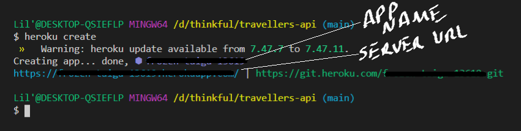

**2:**
* Now let's run ```git push heroku main``` (our initial push into Heroku)
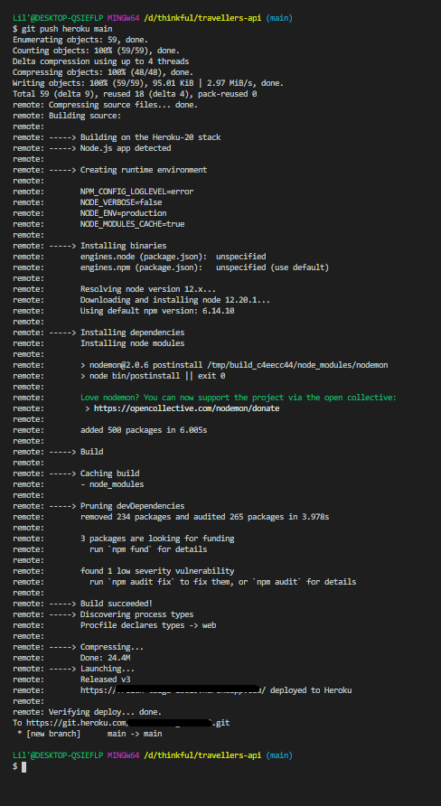

**3:**
* Now to provision Postgres: ```heroku addons:create heroku-postgresql:hobby-dev```
(this now tells us the db has been created and it's empty. Awesome. I'm glad you're keeping up!)


**4:**
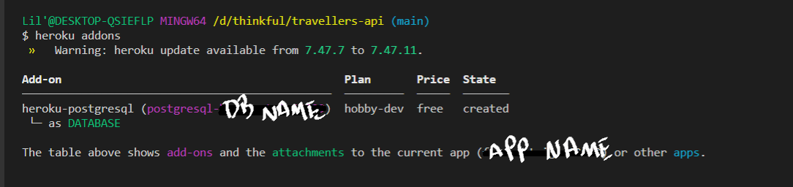

**5:**
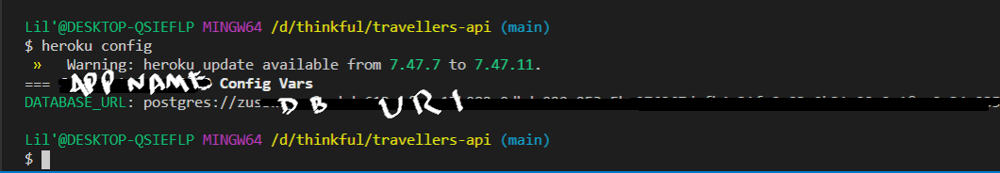

**6:**
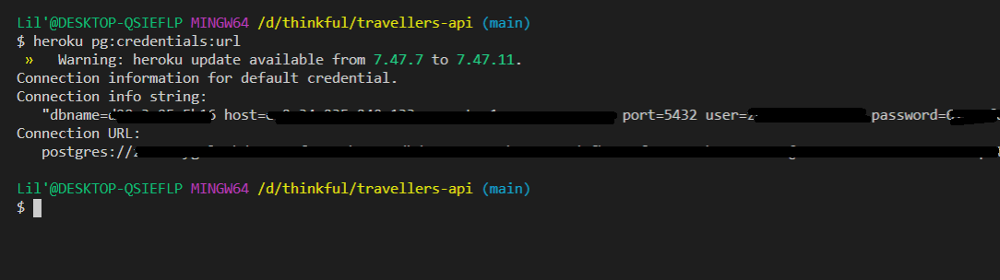

**7:**
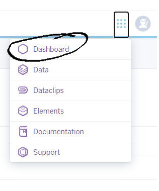

**8:**
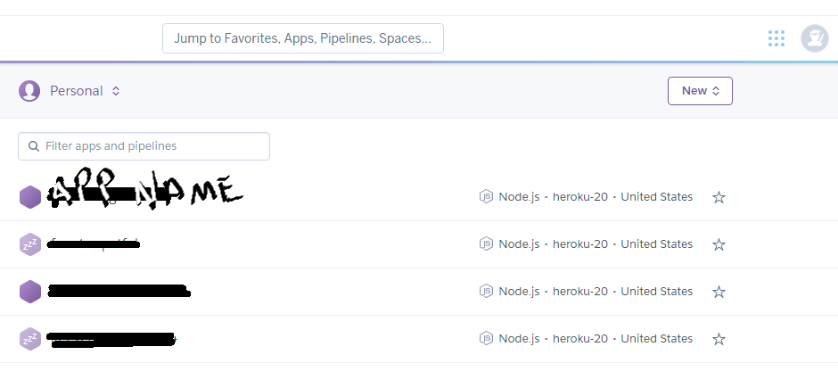

**9:**
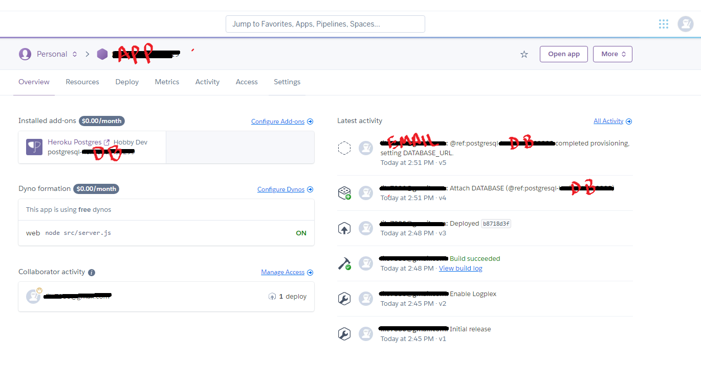

**10:**
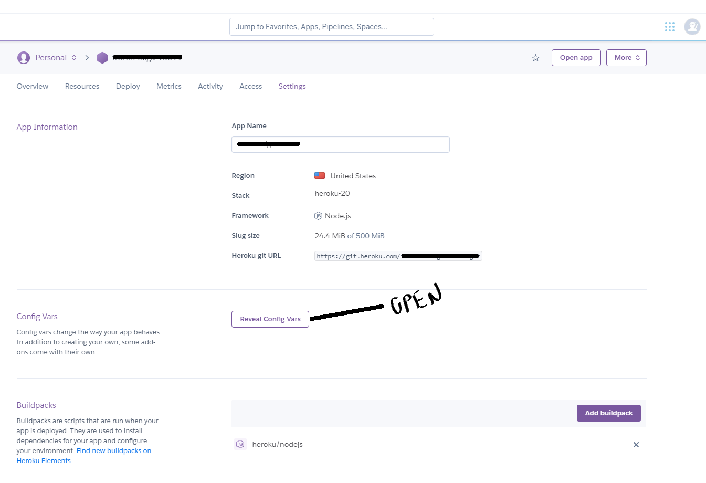

**11:**
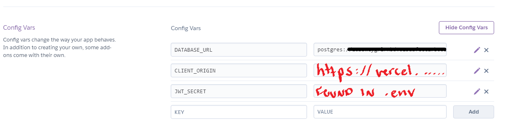

**12:**
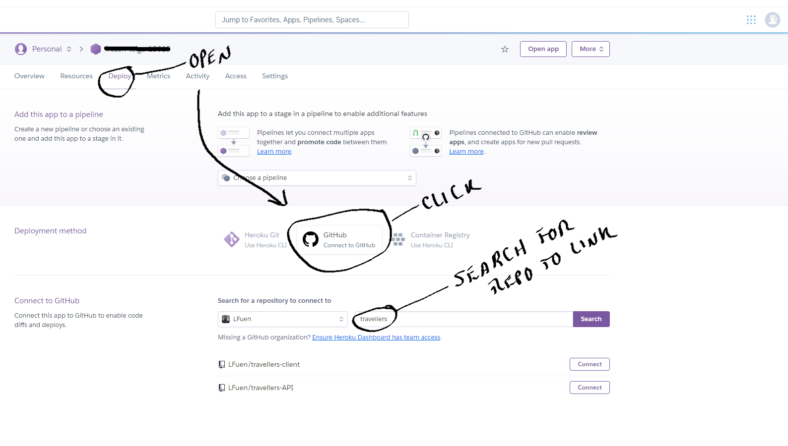

**13:**
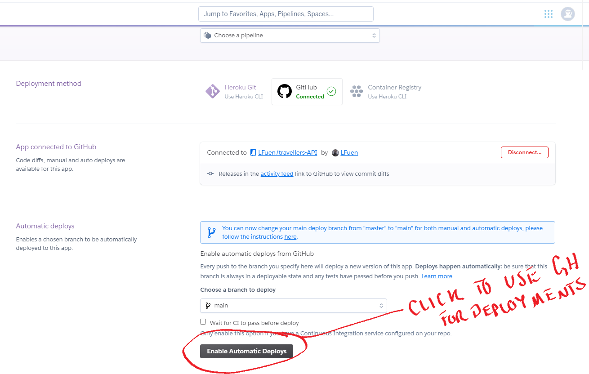


# DATABASE SETUP


**1:**
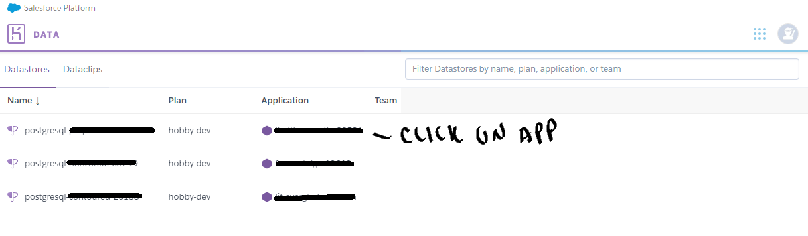

**2:**
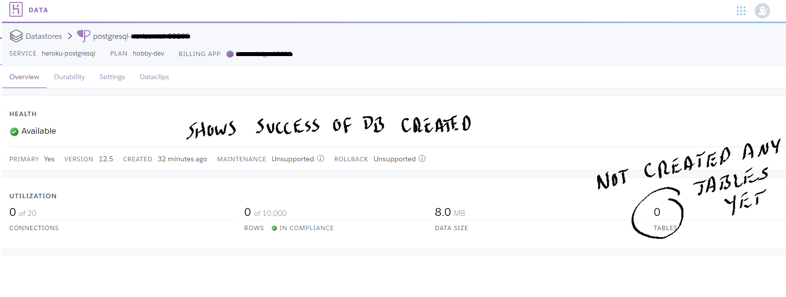

**3:**
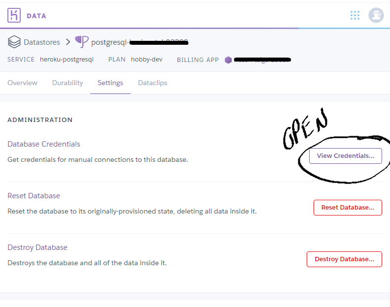

**4:**
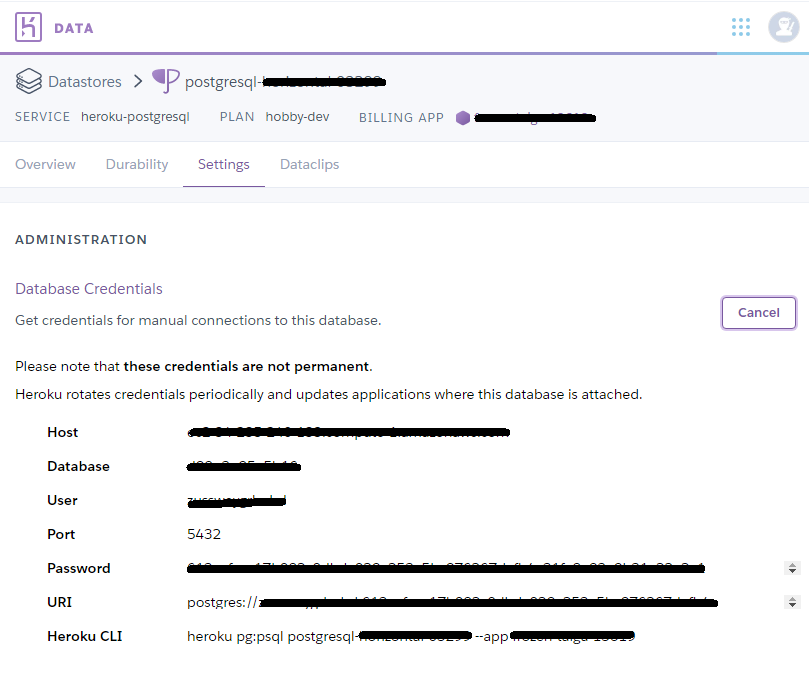

**5:**
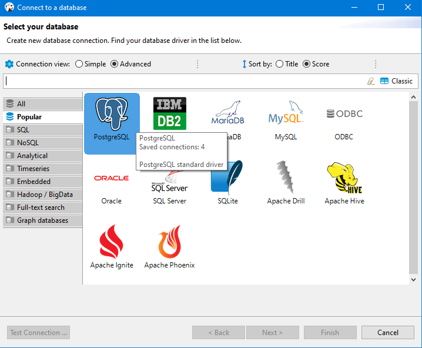

**6:**
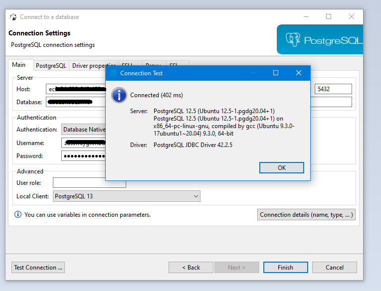

**7:**


**8:**
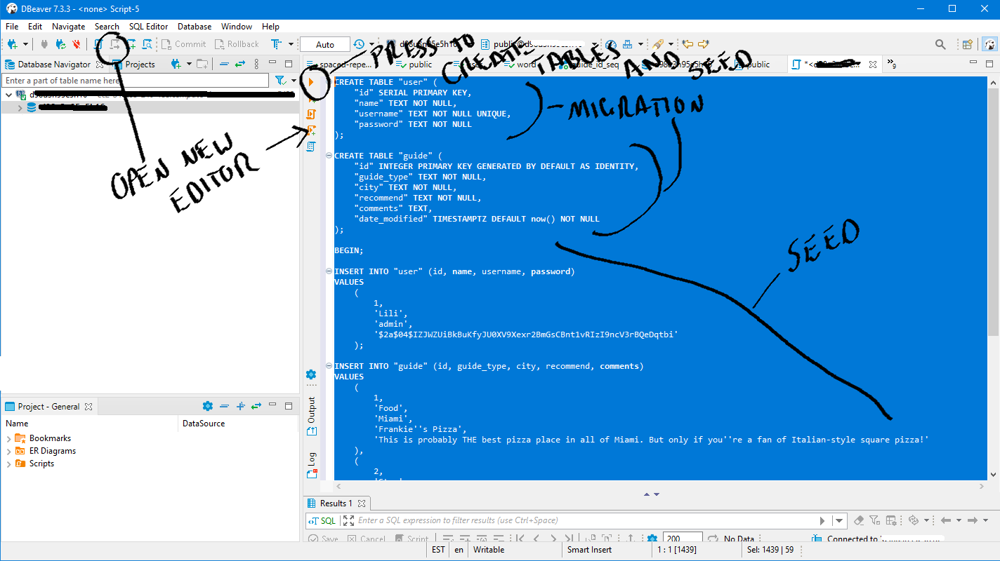

**9:**
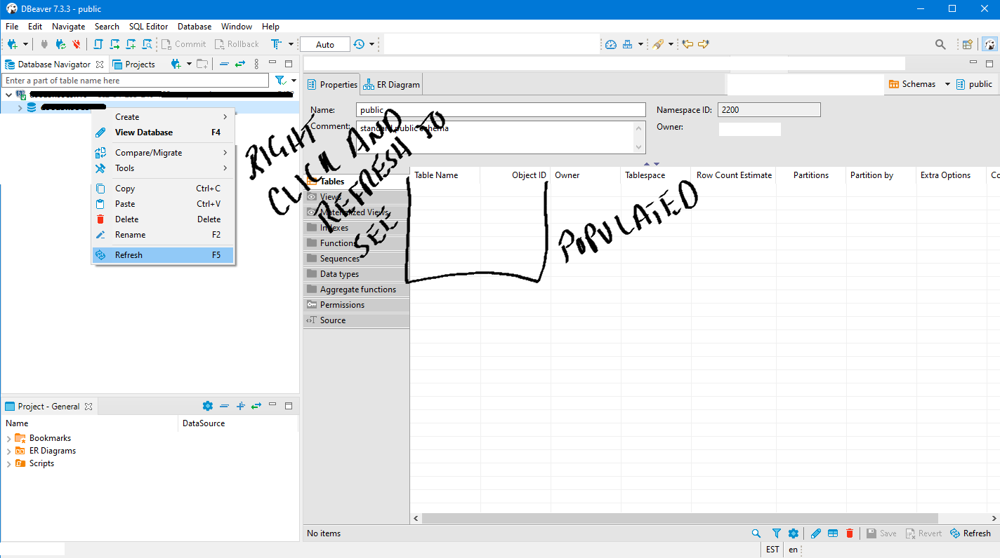

**10:**
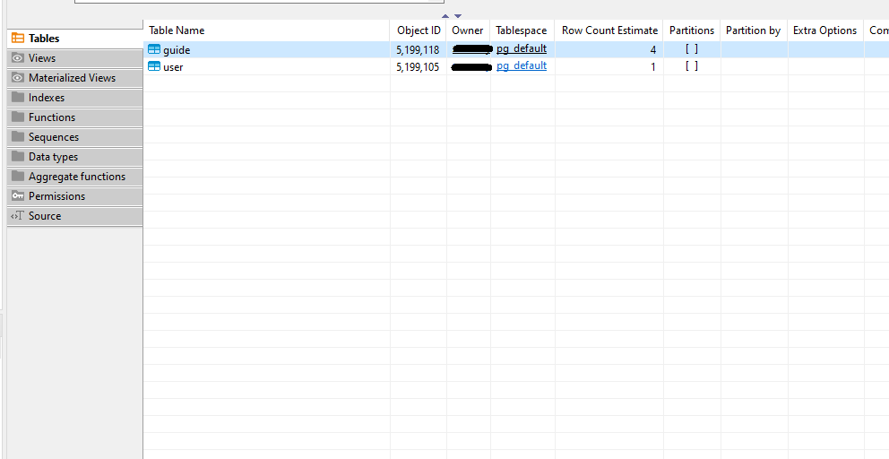

**11:**
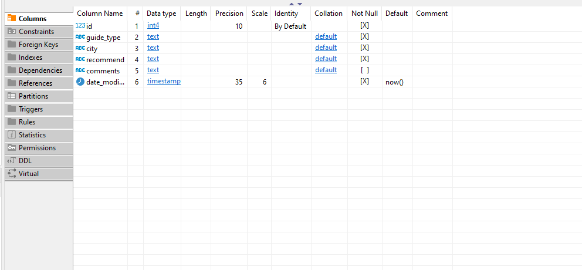

**12:**
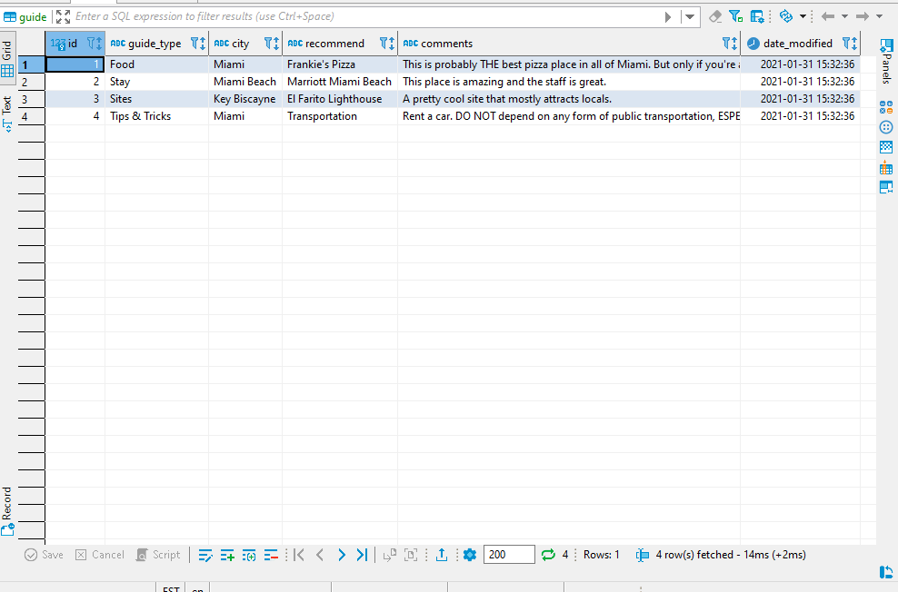


