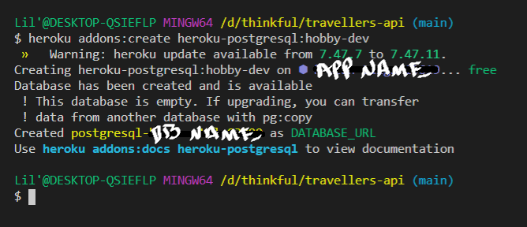
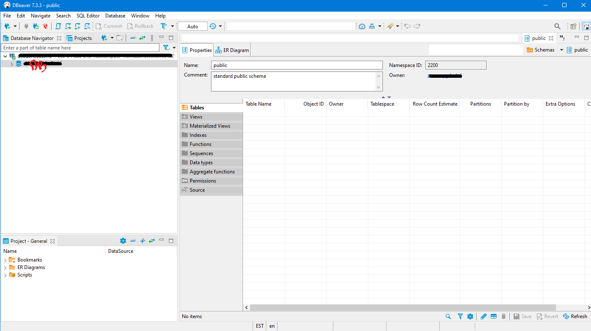

# Heroku Deploy

Deploying to Heroku can be pretty annoying, confusing, and time-consuming. I've put this together using the instructions I was taught. This ALSO serves to implement database usage, so if you want to stop after initially creating a successful upload, that's cool too! It's **PRACTICALLY** fool proof, I promise!!
**
(Assuming you are using: NODE, PG, PostgresQL, DBeaver)
**
Here we go!
**

**Step 1:**
* Have a computer. Alright, I'm kidding.... here's the **real** step one. 
> * Open up your terminal. (I'll be using GITBash on Windows)
> * Heroku has some benefits when using certain libraries. In this case we're using PG and that automatically provisions a Postgres DB...score!
> * In your terminal type in: ```heroku create```


**2:**
* Now let's run: ```git push heroku main``` 
*(our initial push into Heroku)*


**3:**
* Now to provision Postgres: ```heroku addons:create heroku-postgresql:hobby-dev```
(this now tells us the db has been created and it's empty. Awesome. I'm glad you're keeping up!)
*hobby-dev is a free plan to use on Heroku*



# HOLD UP! PRESS PAUSE!
* Let's do a search for the variable name of our database in our files (mine was DB_URL) and change them all to **DATABASE_URL**
*Heroku has a preference, what can I say?*

## OK, PLAY!, Let's continue...

**4:**
* If we want to see the addons in the project, run: ```heroku addons```
*DATABASE will be the addon in this case*


**5:**
* Let's check out the environment variables created with our DB: ```heroku config```


**6:**
* Let's check out out database connection details: ```heroku pg:credentials:url```


**7: Shift to the browser, and log on to Heroku...please.**
* On your screen on the top right you'll see this, let's click on **Dashboard**


**8:**
* That brings you here, where you can choose the app we just created.
*Don't just LOOK at it....Select it!*


**9:**
* Now we're here. This is what your app screen should look like. The activity on the right is telling you all we've done so far.
* From this screen, click on **Settings** which will take you to the next step.


**10:**
* In here we're going to open up **Reveal Config Vars**


**11:**
* Our DB has already been set up by Heroku (we did this already), and now we set up our *CLIENT_ORIGIN* and any other security or permissions our app may need to run successfully. In this case I have a *JWT_SECRET* because I'm using JWT.
* When done, click on **Deploy** up top, taking you to the next step.


**12:**
* Now, let's link our GH to Heroku, killing 2 birds with one stone. This let's us build automatically when we push up into our GH repos instead of a separate command for Heroku each time. I'm terribly forgetful, and leads to confusion and anger as to *WHY ISN'T IT WORKING?!* Let's remove that from the equation shall we?
* Search through your repos and connect which one holds your server/backend files.


**13:**
* Scroll down a bit and click on **Enable Automatic Deploys**


# BOOM! Heroku is set up!!!!!!!!
## Now, let's setup your DATABASE (Using DBeaver)


# DATABASE SETUP


**1:**
* Still in Heroku, let's head over to **Data** instead of **Dashboard** this time. (Top right, the square of dots.)
* Let's open the app we've been working with.


**2:**
* Here we see our DB has been set up successfully, but there are no tables yet. Let's get on that.
* Click on **Settings**


**3:**
* Open **View Credentials**


**4:**
* This is the info we need to connect our DB to DBeaver.


**5:**
* Open DBeaver and choose PostgrSQL as your connection.


**6:**
* Take the info from Heroku that we have opened up and place them according to their names here
> * Host
> * Database
> * Username
> * Password
* And then **Test Connection**, which should give you this message.


**7:**
* This opens up DBeaver and shows you the db on the left, open it by clicking the arrow which takes you to:
> * Schemas, open that for:
>> * public, open that for:
>>> * **Tables**
(*Empty, let's fix that manually.*)



**8:**
* Under **Search** (don't press search, I mean the icon is directly under this), find the **SQL Editor** icon and open that.
* Copy your migrations for your tables into this editor (leave a speace between each migration)
* Then leave another space and bring in your seed file (if you're seeding).
* Highlight all the text inside the editor, and press the orange **Play** button circled.


**9:**
* Now, right-click your database and presh **Refresh**


**10:**
* Your tables have now been created!
* Double-clicking the tables will show you the columns inside


**11:**
* From here, find the **Data** tab above table name, and you'll see your data inside from the seed file.


**12:**
* Like this!


# YESSS!! DONE!! 
*I hope this helped make it less painful! Any questions, comments, or need for further clarifications, please let me know!!*


